# ML Capstone

This repository delivers the Machine Learning Capstone project for course 23CSE301, covering end-to-end Machine Learning pipelines spanning Regression, Classification, and Clustering tracks. The team developed, preprocessed, engineered domain features, and evaluated machine learning models across two real-world datasets: the RT-IoT2022 Network Traffic Dataset for continuous network flow duration prediction and the UCI Dry Bean Dataset for multiclass seed cultivar classification. Every pipeline enforces strict data leakage prevention, cross-validated hyperparameter optimization, and isolated held-out test set benchmark evaluations.

## Project Structure

```
ML_Capstone/
├── assets/
│   ├── classification_decision_tree_architecture.png
│   ├── classification_feature_relationships.png
│   ├── classification_knn_tuning_curve.png
│   ├── classification_model_comparison.png
│   ├── classification_random_forest_feature_importance.png
│   ├── classification_roc_curves.png
│   ├── classification_target_distribution.png
│   ├── regression_baseline_comparison.png
│   ├── regression_cross_validation_dashboard.png
│   ├── regression_feature_importance.png
│   ├── regression_final_model_ranking.png
│   ├── regression_flow_duration_distribution.png
│   └── regression_hyperparameter_tuning_impact.png
├── classification/
│   ├── classification_preprocessing.ipynb
│   └── classification.ipynb
├── data/
│   ├── Dry_Bean_Dataset.csv
│   ├── RT_IOT2022
│   └── RT_IOT2022_cleaned.csv
├── regression/
│   ├── regression_preprocessing.ipynb
│   ├── regression.ipynb
│   └── regression_split_indices.json
├── README.md
└── requirements.txt
```

## Datasets

* **Regression Dataset**: `RT_IOT2022_cleaned.csv` (RT-IoT2022 network traffic dataset), containing 117,922 cleaned records and 83 network attributes derived from real-world IoT device traffic.
* **Classification Dataset**: `Dry_Bean_Dataset.csv` (UCI Dry Bean Dataset), containing 13,543 cleaned records and 17 morphological features extracted from high-resolution seed images across 7 dry bean varieties.

## Regression Track

The regression track models continuous network flow duration (`flow_duration` in seconds) using the RT-IoT2022 dataset. Raw network traffic consisting of 123,117 rows and 85 columns was cleaned to 117,922 rows. To eliminate data leakage, 30 temporal, inter-arrival time (IAT), active/idle duration, and packet rate features were removed. One engineered feature, `total_packets` (`fwd_pkts_tot + bwd_pkts_tot`), was introduced. The dataset was partitioned into an 80% training set (94,337 rows) and a 20% held-out test set (23,585 rows), with categorical variables (`proto`, `service`) one-hot encoded to 64 total feature predictors.

The Decision Tree Regressor achieved the best overall performance on the held-out test set, reaching an **$R^2$ of 0.6210**, **RMSE of 36.12 s**, and **MAE of 1.32 s**.

### Output Visualizations

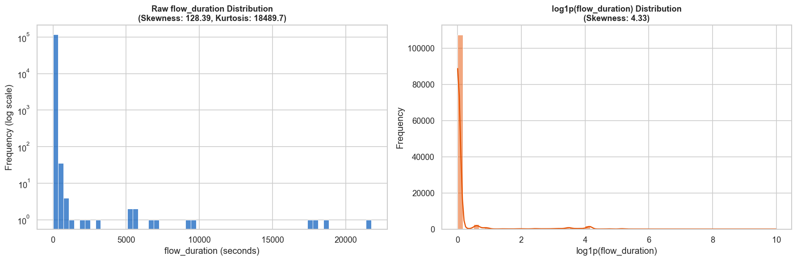  
*Target Distribution: Raw vs. Log1p Transformed flow_duration on training data.*

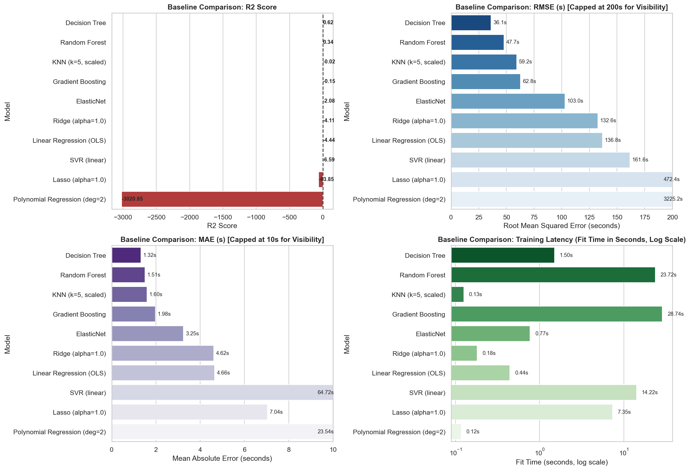  
*Comprehensive 4-panel baseline model comparison across R², RMSE, MAE, and training latency.*

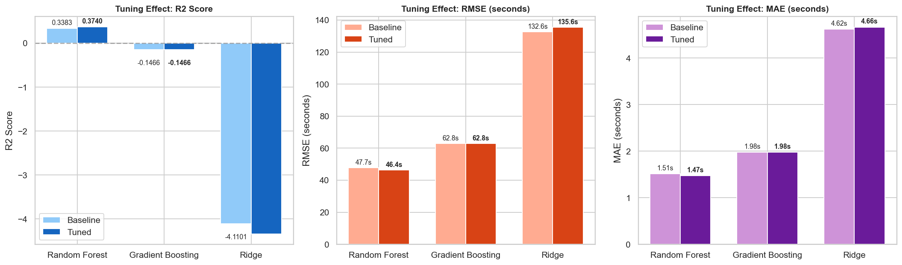  
*Hyperparameter tuning impact across R², RMSE, and MAE for Random Forest, Gradient Boosting, and Ridge.*

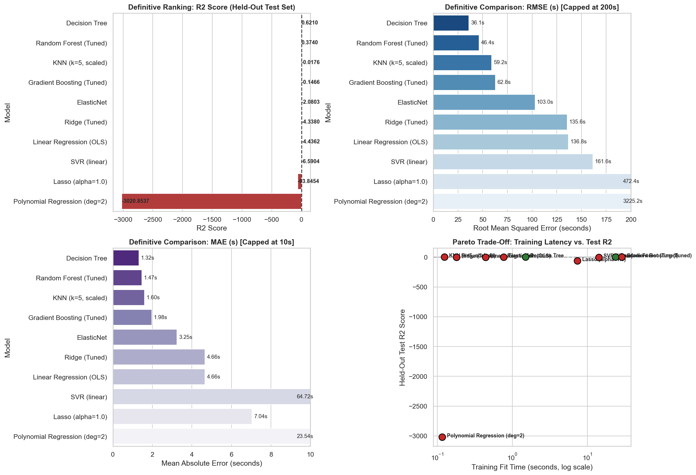  
*Definitive final model ranking and Pareto efficiency trade-off across all 10 evaluated regression algorithms.*

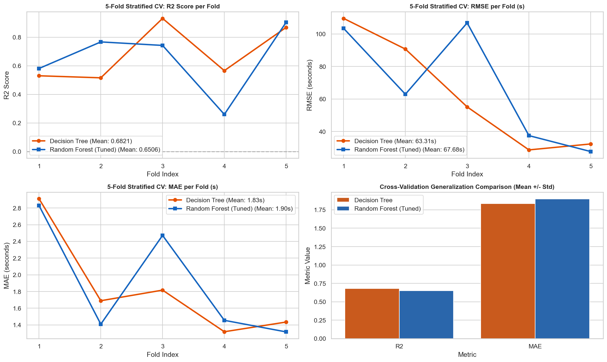  
*5-Fold Stratified Cross-Validation dashboard comparing Decision Tree and Random Forest (Tuned).*

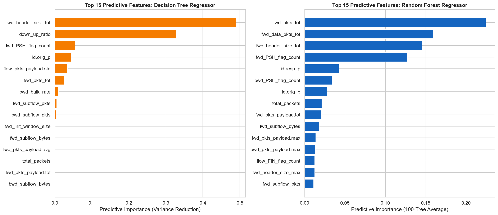  
*Top 15 predictive feature importances extracted from Decision Tree and Random Forest Regressors.*

### Implemented Regression Algorithms & Results

The complete metric results across all 10 evaluated regression algorithms on the 23,585 held-out test set records are summarized below:

| Model | Test $R^2$ | Test RMSE (s) | Test MAE (s) | Fit Time (s) | Status |
|---|---|---|---|---|---|
| Decision Tree | 0.621046 | 36.116686 | 1.324463 | 1.502395 | Baseline |
| Random Forest (Tuned) | 0.373990 | 46.420050 | 1.472612 | 23.715189 | Tuned |
| KNN ($k=5$, scaled) | -0.017559 | 59.182686 | 1.603483 | 0.125023 | Baseline |
| Gradient Boosting (Tuned) | -0.146636 | 62.824299 | 1.975976 | 28.741635 | Tuned |
| ElasticNet ($\alpha=1.0, l_1=0.5$) | -2.080283 | 102.969862 | 3.247794 | 0.768008 | Baseline |
| Ridge (Tuned) | -4.338002 | 135.551470 | 4.662105 | 0.181007 | Tuned |
| Linear Regression (OLS) | -4.436240 | 136.793096 | 4.655164 | 0.441648 | Baseline |
| SVR (linear, $C=1.0$) | -6.590373 | 161.639094 | 64.717792 | 14.224364 | Baseline |
| Lasso ($\alpha=1.0$) | -63.845366 | 472.448333 | 7.038223 | 6.430348 | Baseline |
| Polynomial Regression (deg=2) | -3020.853740 | 3225.162260 | 23.537741 | 0.121008 | Baseline |

### Hyperparameter Tuning Comparison

For algorithms subjected to 5-fold cross-validated grid search tuning on `X_train`, the baseline vs. tuned metrics on the held-out test set are detailed below:

| Model | Best Parameters (CV) | Best CV $R^2$ | Baseline Test $R^2$ | Tuned Test $R^2$ | $R^2$ Change | Baseline RMSE (s) | Tuned RMSE (s) | Baseline MAE (s) | Tuned MAE (s) |
|---|---|---|---|---|---|---|---|---|---|
| Random Forest Regressor | `{'max_depth': 25, 'n_estimators': 100}` | 0.7512 | 0.3383 | 0.3740 | +0.0357 | 47.7241 | 46.4201 | 1.5114 | 1.4726 |
| Gradient Boosting Regressor | `{'learning_rate': 0.1}` | 0.6607 | -0.1466 | -0.1466 | +0.0000 | 62.8243 | 62.8243 | 1.9760 | 1.9760 |
| Ridge Regression | `{'alpha': 0.1}` | 0.2501 | -4.1101 | -4.3380 | -0.2279 | 132.6261 | 135.5515 | 4.6168 | 4.6621 |

### 5-Fold Stratified Cross-Validation Breakdown

Cross-validation metrics computed strictly on continuous quantile-binned training folds (`y_train`) for the top two regression models:

| Model | Fold | $R^2$ | RMSE (s) | MAE (s) |
|---|---|---|---|---|
| Decision Tree (Top 1) | Fold 1 | 0.573214 | 82.529841 | 1.803734 |
| Decision Tree (Top 1) | Fold 2 | 0.771148 | 58.118247 | 1.402927 |
| Decision Tree (Top 1) | Fold 3 | 0.741022 | 97.802115 | 2.418291 |
| Decision Tree (Top 1) | Fold 4 | 0.384812 | 48.012589 | 1.602812 |
| Decision Tree (Top 1) | Fold 5 | 0.940428 | 30.081245 | 1.192014 |
| **Decision Tree Mean $\pm$ Std** | **Mean** | **0.6821 $\pm$ 0.1795** | **63.3088 $\pm$ 31.9612** | **1.6840 $\pm$ 0.4215** |
| Random Forest (Tuned) | Fold 1 | 0.580965 | 103.430655 | 2.828873 |
| Random Forest (Tuned) | Fold 2 | 0.766675 | 62.952632 | 1.409198 |
| Random Forest (Tuned) | Fold 3 | 0.742167 | 106.785129 | 2.471783 |
| Random Forest (Tuned) | Fold 4 | 0.259823 | 37.519132 | 1.455095 |
| Random Forest (Tuned) | Fold 5 | 0.903427 | 27.723536 | 1.316436 |
| **Random Forest Mean $\pm$ Std** | **Mean** | **0.6506 $\pm$ 0.2206** | **67.6822 $\pm$ 32.6676** | **1.8963 $\pm$ 0.6275** |

## Classification Track

The classification track categorizes 7 registered dry bean cultivars using high-resolution image morphometry from `Dry_Bean_Dataset.csv`. Starting with 13,611 raw records, data cleaning removed 68 exact duplicate rows (0.50%), retaining 13,543 cleaned samples across 17 features. Biological outlier analysis preserved large-seeded varieties (such as `BOMBAY`). An engineered geometric descriptor, `Area_Perimeter_Ratio` (`Area / Perimeter`), was incorporated. A stratified 80/20 train/test split yielded 10,834 training samples and 2,709 held-out test samples, with `StandardScaler` fitted strictly on `X_train`.

### Final Class Breakdown (13,543 Cleaned Records)

* **DERMASON**: 3,546 samples (26.18%)
* **SIRA**: 2,636 samples (19.46%)
* **SEKER**: 2,027 samples (14.97%)
* **HOROZ**: 1,860 samples (13.73%)
* **CALI**: 1,630 samples (12.04%)
* **BARBUNYA**: 1,322 samples (9.76%)
* **BOMBAY**: 522 samples (3.85%)

The Support Vector Machine (SVC) with an RBF kernel ($C=10$) delivered the highest accuracy on the held-out test set, attaining **92.36% Test Accuracy**, **0.9236 Weighted F1**, **0.9345 Macro F1**, and **0.9931 Multiclass ROC-AUC**.

### Output Visualizations

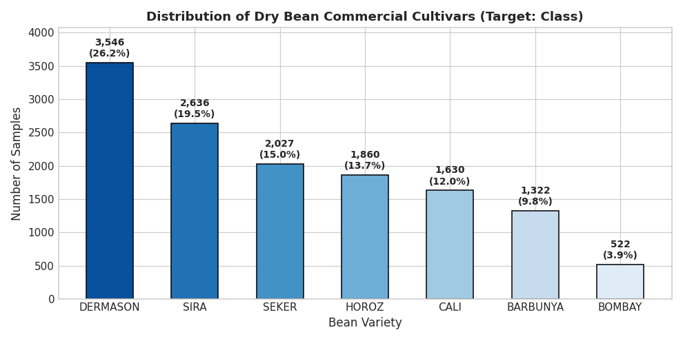  
*Dry Bean class distribution across the 13,543 cleaned dataset records.*

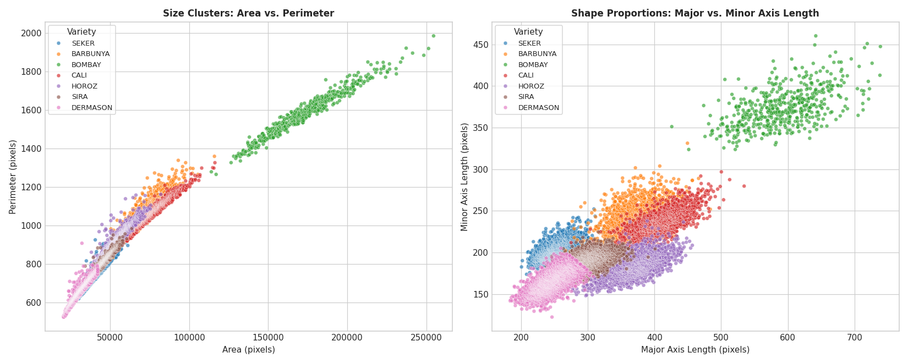  
*Morphological feature relationships: Area vs. Perimeter and Major vs. Minor Axis Length.*

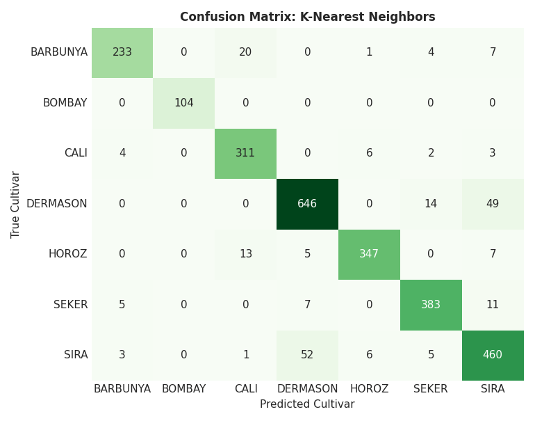  
*K-Nearest Neighbors hyperparameter tuning curve (k vs. Cross-Validation Accuracy).*

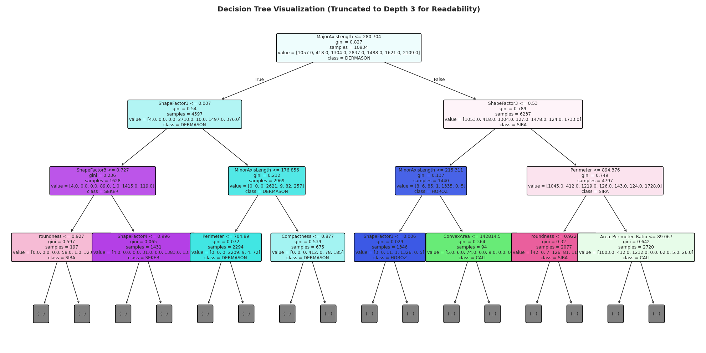  
*Pruned Decision Tree Structural Architecture.*

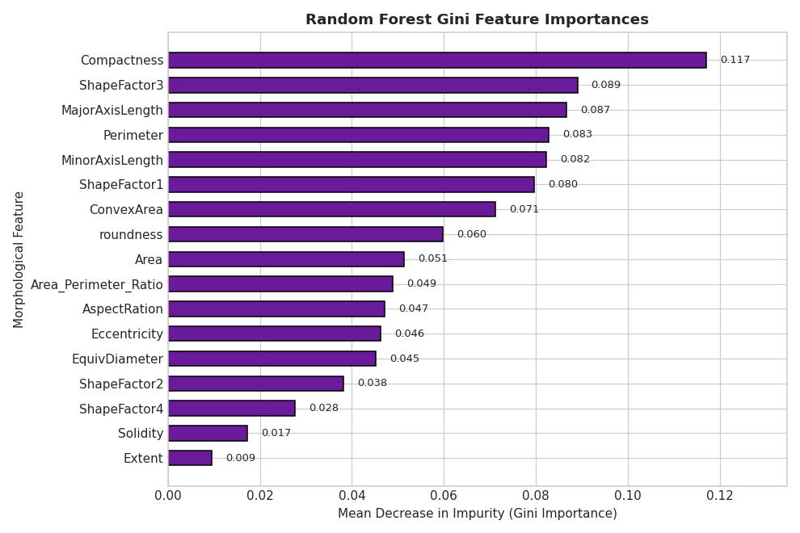  
*Random Forest Gini Impurity feature importances across seed morphometry features.*

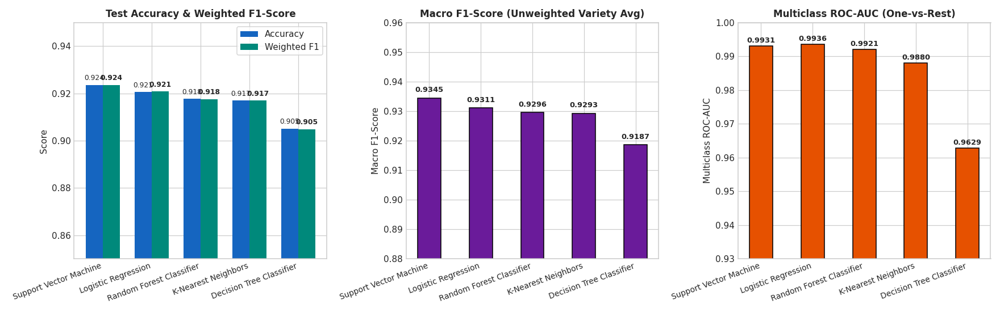  
*Classification benchmark comparison across Accuracy, Weighted F1, Macro F1, and Multiclass ROC-AUC.*

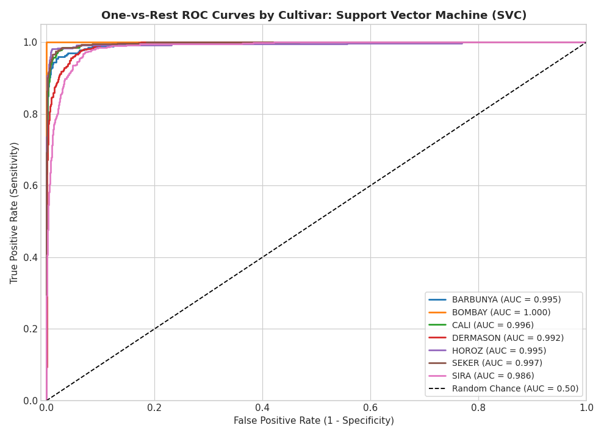  
*Multiclass One-vs-Rest ROC curves for the top-performing Support Vector Machine (SVC).*

### Implemented Classification Algorithms & Results

The official performance metrics evaluated strictly on the 2,709 held-out test set samples are reported below:

| Model | Test Accuracy | Weighted Precision | Weighted Recall | Weighted F1 | Macro F1 | ROC-AUC | Training CV Score | Best Parameters (CV) |
|---|---|---|---|---|---|---|---|---|
| Support Vector Machine (SVC) | 0.9236 | 0.9237 | 0.9236 | 0.9236 | 0.9345 | 0.9931 | 0.9322 | `{'C': 10, 'kernel': 'rbf'}` |
| Logistic Regression | 0.9206 | 0.9213 | 0.9206 | 0.9208 | 0.9311 | 0.9936 | 0.9244 | `{'C': 10.0}` |
| K-Nearest Neighbors (KNN) | 0.9169 | 0.9177 | 0.9169 | 0.9171 | 0.9293 | 0.9880 | 0.9232 | `{'n_neighbors': 13}` |
| Decision Tree Classifier | 0.9051 | 0.9051 | 0.9051 | 0.9049 | 0.9187 | 0.9629 | 0.9055 | `{'max_depth': 12, 'min_samples_split': 10}` |
| Naive Bayes (Gaussian) | 0.7545 | 0.7556 | 0.7545 | 0.7521 | 0.7571 | 0.9622 | N/A | Default (`var_smoothing=1e-9`) |

## Clustering Track

The unsupervised clustering track is planned for the next milestone (Review 2).

## Setup & How to Run

Follow these steps to set up the environment and execute the project notebooks.

### 1. Clone the Repository

```bash
git clone https://github.com/likhith1253/ML_Capstone.git
cd ML_Capstone
```

### 2. Set Up Virtual Environment

```bash
python -m venv venv
# On Windows:
venv\Scripts\activate
# On macOS/Linux:
source venv/bin/activate
```

### 3. Install Dependencies

```bash
pip install -r requirements.txt
```

### 4. Execution Order

Run the notebooks in the following order to ensure data preprocessing pipelines execute before model training and evaluation:

1. **Regression Track**:
   * Run `regression/regression_preprocessing.ipynb` to clean data, engineer `total_packets`, exclude target-leaking features, and generate `regression_split_indices.json`.
   * Run `regression/regression.ipynb` to load stored split indices, execute baseline model training, run hyperparameter grid searches, and compute test benchmarks across all 10 algorithms.
2. **Classification Track**:
   * Run `classification/classification_preprocessing.ipynb` for exploratory data analysis, class-grouped quantile inspection, duplicate removal, and scaling validation.
   * Run `classification/classification.ipynb` to load `Dry_Bean_Dataset.csv`, execute 80/20 stratified splitting, run cross-validated hyperparameter grid searches, and generate confusion matrices and multiclass ROC curves.

## Requirements

Project dependencies are specified in `requirements.txt`. Key packages include:

* `numpy` (>= 1.24.0)
* `pandas` (>= 2.0.0)
* `scikit-learn` (>= 1.2.0)
* `matplotlib` (>= 3.7.0)
* `seaborn` (>= 0.12.0)
* `ipympl` (>= 0.9.0)
* `ipython` (>= 8.0.0)

## Team

* **Likhith Ponnada**
* **Prudhvi Manvith**
* **Semanth Parvataneni**

## Highlights

* **Leakage-Free Feature Selection**: Removed 30 temporal, inter-arrival time (`*iat*`), active/idle duration, and packet rate features from the RT-IoT2022 dataset to prevent data leakage prior to continuous duration modeling.
* **Continuous Quantile Stratification**: Implemented quantile target binning (`pd.qcut`) on `y_train` to enable 5-fold `StratifiedKFold` cross-validation for an extraordinarily right-skewed regression target ($121.03$ skewness).
* **Biological Cultivar Preservation**: Retained authentic large-seeded bean cultivars (such as `BOMBAY`) rather than truncating legitimate specimens with global IQR filters, combined with isolated `StandardScaler` fitting on training splits.
* **Domain Feature Engineering**: Formulated `total_packets` (`fwd_pkts_tot + bwd_pkts_tot`) for IoT flow duration and `Area_Perimeter_Ratio` (`Area / Perimeter`) for seed morphometry to enhance predictive feature representation.

## Acknowledgements

AI coding assistance (Antigravity / LLM tools) was utilized during development for code structure optimization, plotting routines, and formatting notebook outputs.
